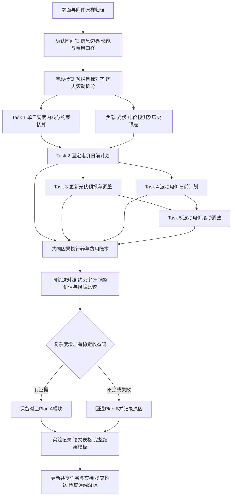

# 1 任务回顾（用一句话重述每个任务）

> 输入同步状态：原始题面、附件、空白模板与结构报告目前仅本地保存；尚未提交Git。队友拉取可恢复规划文档，数值复现需先按 `data/AVAILABILITY.md` 取得输入。

状态：候选路线与推荐组合，尚未最终选型、编写求解器或产生数值实验。依据 `problem/C题.pdf`、`problem/task-map.md` 与 `data/structure-audit.json`。团队语言、求解器经验和分工未知，暂按三人协作、优先可复现与可解释、仅使用附件安排。

| 任务 | 目标与输入 | 必须输出 |
| --- | --- | --- |
| Task 1 / 问题1 | 附件1给定日内负载、光伏预测与电价，优化购电和储能 | 144区间计划、日费用、充放电与日初日末储电量；result1.xlsx |
| Task 2 / 问题2 | 固定日内电价下，从历史供需信息制定日前计划，处理5倍电价的紧急购电 | 2—12月逐日计划、实际运行及紧急购电；result2.xlsx |
| Task 3 / 问题3 | 按0/6/12/18时光伏预报，在调整费与缺电风险间取舍 | 原计划、调整后计划、最终运行、费用分解；result3.xlsx；调整价值结论 |
| Task 4 / 问题4-2 | 将波动电价引入问题2的日前决策 | 问题2全部对应结果；result4-2.xlsx |
| Task 5 / 问题4-3 | 将波动电价引入问题3的日内调整 | 问题3全部对应结果；result4-3.xlsx |

论文指定展示日期为2025-03-20、06-21、09-23、12-21；完整提交期为2025-02-01至12-31，共334天。上述文件名指未来交付物，仓库 `data/templates/` 中同名文件只是原始空白模板。

## 先确定会影响所有路线的口径

- **时间轴（待确认）**：附件1/2/4从0:10到24:00，而结果模板从0:10–0:20开始，末尾延至次日0:10。建议内部统一为当天144个区间，明确输入时点的代表意义，并把模板标签映射单独保存；未确认前不能声称模板已可直接导出。
- **信息边界（建议）**：问题2默认当天未来负载和光伏不可知；问题3只使用发布时间不晚于决策时刻的光伏预报，负载仍需估计；问题4未来价格是否已知未明确，主线按未知、预测后决策，已知价格仅作注明条件的对照。
- **储能边界（待确认）**：容量12000 kWh、运行电量1200–10800 kWh、最大充放电功率5000 kW、1月1日0:00初始6000 kWh为题面事实。问题1必须日初日末相等；问题2—4跨日连续衔接，不默认每日重置或强加每日相等。90%效率的单程/往返含义、功率与电量计量侧需声明。
- **费用账本（待确认）**：问题2紧急购电按交易电价5倍结算；问题3增购1.5倍、减购违约价0.5倍。减购是否退原购电费、多次调整相对原计划还是上次计划、费用比较对应何时电价，必须先固定解释。不能凭习惯替题面补规则。
- **供需处理（建议）**：不假设可向外网售电；多余电力如何弃用单独记账，不靠同时充放电消耗多余电量。实时执行仅使用当前及历史实际信息；不能逐日调用全天实际供需优化后称为实时回放。
- **共同评价**：相同输入、信息可用时刻、初末储电量处理、实时执行规则、费用账本下比较。末端库存不同须单列或设置共同终端约束，不能把消耗更多初始电量当节省。

口径记录见 `memory/decisions/D-002-c-model-planning.md`；这里只提出处理建议，不代替团队确认。

# 2 模型方向菜单

所有路线共同检查：供需平衡残差、储电量及功率越界次数、充放电互斥、费用重算误差、跨日状态连续性。出现未解释的物理约束违例，先修正再比较费用。各路线以下另列至少两项指标；本文件没有任何已测得的改善百分比。

## Task 1：单日确定性购电与储能调度

### 方向 1（Baseline）：线性规划调度

- 原理解释：把每个10分钟区间的购电、充电、放电和储电量作为决策量，按电价给购电量计费，利用线性的能量关系连接全天。在满足供电、功率、容量和日末要求的方案中降低费用。
- 适用条件：计费与储能关系可以线性表示；采用清楚的多余电力处理方式；解中不出现同时充放电，或能在明确条件下证明这种行为不会改善目标。
- 优点/缺点：结构紧凑，能作为后续各问的共同内核；但不能未经检查就声称充放电天然互斥。评委能直接核对目标和约束，比只给启发式曲线更容易审查。
- 难度/风险：低—中；主要风险在单位、效率和终端边界，而非求解规模。
- 验证指标：全天购电费用；最大能量平衡残差；日末与日初电量差；同时充放电区间数。

### 方向 2（稳健/可解释）：含充放电互斥的混合整数线性规划

- 原理解释：给每个区间增加充电/放电模式，让设备不能同一时段既充又放，其余能量和费用结构沿用基线。
- 适用条件：团队能运行混合整数求解器，且设备按区间采用单一充放电模式。
- 优点/缺点：物理行为明确，也便于迁移到后续问题；引入整数变量后要报告求解状态和最优性间隙。评委视角的优势是约束可审计，不是变量更多。
- 难度/风险：中；超时返回的可行解不能标为已证全局最优。
- 验证指标：与LP基线费用差；最优性间隙或求解状态；耗时；互斥及日末约束违例数。

### 方向 3（冲奖创新）：费用优先的二级调度与储能价值解释

- 原理解释：先找到最低费用或明确容差内的费用，再在这些方案中减少无必要的充放电吞吐或模式切换；结合容量/功率小幅变化解释哪些时段限制了收益。
- 适用条件：方向2已经稳定，有多解、近似等价解或设备操作频繁的现象；二级目标仅作题目经济目标后的择优规则。
- 优点/缺点：能把“最优曲线”进一步解释为可执行策略；但需要额外求解，不能无数据加入电池寿命费用或把小改动包装成重大创新。
- 难度/风险：中；必须明确费用容差，防止二级目标实际牺牲主要目标。
- 验证指标：相对一级目标的费用增量；总充放电吞吐；模式切换次数；参数变化下的边际费用变化。
- 评委视角：问题1的价值在正确、简洁与解释充分，不需要为冲奖强行引入复杂模型。

## Task 2：固定电价下的风险日前计划

### 方向 1（Baseline）：历史日曲线预测＋确定性优化

- 原理解释：用已发生的相近日、相同星期类型或过去同一时刻估计当天负载与光伏，形成净负载预测，再调用Task 1内核。执行时用当前实际值和当前储电量处理偏差，不够的部分紧急购电。
- 适用条件：只有附件中的历史供需和日期信息，需要先建立可运行对照。历史窗口、同类日规则只能用过去数据调整。
- 优点/缺点：容易复现、便于定位误差来源；点预测忽略尾部缺口。评委可据此判断后续风险模型是否带来实际增益。
- 难度/风险：低—中；光伏夜间接近零，不能用普通MAPE作为主要指标；不得随机拆分同一天的时点到训练和测试。
- 验证指标：净负载MAE；实际总费用；紧急购电量及次数；无储能可行对照下的费用差。

### 方向 2（稳健/可解释）：分时误差分位数余量＋储能备用

- 原理解释：从过去的滚动预测误差识别容易低估需求的时段，按误差分位数预留购电余量或电池余量，用历史验证中的实际总费用权衡“多买”和“缺电”。
- 适用条件：已有可用的历史残差；样本少时合并相邻时段并报告不确定性；余量与储能约束必须共同优化。
- 优点/缺点：风险控制含义清楚，较容易解释5倍紧急电价为何导致保守计划；各时段的分位数不等于整天供电概率保证。评委会关注额外计划费用是否抵消紧急费用节省。
- 难度/风险：中；不能直接按5倍电价推导一个全局固定“最优分位数”，因为储能和跨期决策改变边际成本。
- 验证指标：实际总费用；紧急购电占负载电量比例；余量覆盖率及校准偏差；多买后弃用电量。

### 方向 3（冲奖创新）：保持时间相关性的供需场景＋尾部费用控制

- 原理解释：以历史连续误差片段形成多条可能的日内供需轨迹，所有轨迹共享日前购电计划；执行决策只响应当时已观测信息，同时关注平均费用和最坏一小部分日子的平均费用（CVaR）。
- 适用条件：方向1/2已完成，历史样本足以构造合理场景，团队能处理场景规模与非预见性约束。
- 优点/缺点：可刻画连续光伏偏低等风险，风险偏好也能解释；一年数据不能支持过细的季节尾部估计。评委会要求显示风险收益曲线，而不是只报训练场景中的好结果。
- 难度/风险：高；若场景中的储能补救动作提前看见整条未来轨迹，就形成完美预知优势，不能当作可执行策略。需使用非预见性场景树或固定因果执行策略评价。
- 验证指标：逐日实际总费用；高费用尾部均值及样本量；紧急购电量；对场景数和重采样的稳定性；计算时间。
- 评委视角：创新应落在“保持误差时序结构、改善真实费用风险”上，有独立回放证据才值得保留。

## Task 3：固定电价下利用新光伏预报调整

### 方向 1（Baseline）：点预测滚动优化

- 原理解释：0:00制定原始计划，6/12/18时读取当时发布的光伏预报及已实现储电量，重算尚未执行区间，目标包含规定的调整费用；保留不调整这一可行选项。
- 适用条件：预报发布时间与目标时间已正确对齐，小时功率到10分钟的映射已确定，费用口径已固定。
- 优点/缺点：与题目机制直接一致，复用前两问框架；仅使用点预测会低估剩余误差。评委重点看是否严格只更改未来计划。
- 难度/风险：中；0:00、6:00发布的“预报1小时”对应不同目标时刻，跨日不能按列直接匹配。
- 验证指标：相对只用0:00预报的实际费用差；调整购电相关费用；紧急购电量；预报可用性违规次数。

### 方向 2（稳健/可解释）：经济收益触发的滚动调整

- 原理解释：在允许更新的时刻比较“保持现计划”和“更新计划”的预期总费用，仅当预计净节省超过基于历史误差确定的门槛时才调整，并保留必要的储能备用。
- 适用条件：已有方向1基线和过去预测误差；门槛可用前序时间窗口校准，不能看完全年结果后倒选门槛。
- 优点/缺点：可以直接回答何时值得采用更新预报，并减少对小幅预测变化的反应；门槛过高会错过有效调整。若优化目标已含调整费，门槛应解释为对预测不确定性的额外保护，不能重复计费。
- 难度/风险：中；“触发”只在6/12/18时等允许决策时点进行，不虚构新增预报。
- 验证指标：实际总费用；有效调整比例（事后有益的调整占比，作为诊断而非实时选择）；调整次数；紧急购电量。

### 方向 3（冲奖创新）：按预报提前期校准的场景滚动控制

- 原理解释：分别估计短提前期与长提前期的光伏误差，在每个预报发布时更新未来场景，用因果滚动优化同时决定购电调整和储能备用，再比较不同发布时刻带来的信息价值。
- 适用条件：足够的历史预报—实测对齐样本，以及已经可运行的滚动求解器；校准分组过小时需合并。
- 优点/缺点：能说明为什么某些时刻的新预报更有价值；增加场景与误差模型可能放大调参负担。评委会看“信息价值”是否通过一致的费用账本验证。
- 难度/风险：高；不能用未来发布的预报构造当前状态；跨午夜窗口必须承接真实状态且采用一致终端处理。
- 验证指标：预报区间覆盖率/区间宽度；实际总费用与尾部费用；紧急购电量；移除6/12/18时预报后的费用变化；单次优化时间。
- 评委视角：用预报时刻消融解释收益来源，比单纯声称MPC先进更有说服力。

## Task 4：波动电价下的日前计划

### 方向 1（Baseline）：历史电价预测＋点预测日前优化

- 原理解释：先用前日同一时刻或历史同类日估计未来电价，结合供需预测产生计划，执行后按实际电价结算。
- 适用条件：按未来电价未知解释题目；若团队确认未来价格提前公布，则直接输入可用价格并清楚标注信息条件。
- 优点/缺点：容易在Task 2基础上运行；价格MAE小也可能把高低价时段排序弄错。评委应看到同一实际价格轨迹上的策略比较。
- 难度/风险：中；不得通过把附件4的当天全部实测值放入0:00计划而获得未说明的先知信息。
- 验证指标：价格MAE；实际总费用；紧急购电量；低价充电/高价放电选择的事后费用贡献。

### 方向 2（稳健/可解释）：价格误差范围＋风险余量的稳健日前优化

- 原理解释：用历史价格预测残差给未来价格设置合理变化范围，同时沿用供需备用，在一定保守程度下寻找不易被价格偏差破坏的计划。
- 适用条件：存在可校准的价格误差；不确定范围和保守程度只能由过去数据选择。
- 优点/缺点：决策对价格误差更稳健，容易展示收益与保守程度的关系；若允许所有时点同时取极端值，计划可能过分保守。评委会关注稳健保护是否值得其额外费用。
- 难度/风险：中—高；避免把价格、供需分别取最坏后机械相加，导致不合理的极端组合。
- 验证指标：平均实际费用；高费用日尾部均值；紧急购电量；价格偏差情景下的费用变化。

### 方向 3（冲奖创新）：供需—价格联合场景日前优化

- 原理解释：按历史连续时间片段联合抽取价格和供需误差，保留它们可能的相关关系，在同一计划下权衡高价恰逢缺电的联合风险。
- 适用条件：先检验相关性和样本支持；相关关系不稳定时，应保留独立场景作为对照而非强行建立复杂依赖。
- 优点/缺点：能刻画单独考虑价格或供需时遗漏的费用风险；仅一年数据，极端联合事件可能很少。评委会要求联合建模相对独立建模的消融证据。
- 难度/风险：高；场景补救同样必须满足非预见性，场景效果不能只在场景自身上评价。
- 验证指标：同轨迹实际费用；高价缺电事件的费用贡献；尾部费用及事件数；联合/独立场景的对照差；耗时。
- 评委视角：先证明数据存在值得建模的关联，再谈联合模型的创新性。

## Task 5：波动电价下的日内调整

### 方向 1（Baseline）：价格预测参与的点预测滚动优化

- 原理解释：沿用Task 3滚动流程，把固定电价替换为决策时可获得的价格预测；只按真实可见的信息更新价格估计，最终用实际价格结算。
- 适用条件：Task 3及Task 4基线已完成，未来价格可见性和调整结算规则已确认。
- 优点/缺点：模块复用最多、最容易交付完整五份结果；价格和光伏同时预测失误时可能调整失当。评委可从逐项费用看清变化来源。
- 难度/风险：中；不能把“实时价格可见”混同为“未来24小时价格可见”。
- 验证指标：相对波动电价不调整策略的总费用差；调整费用；紧急购电量；求解失败或超时次数。

### 方向 2（稳健/可解释）：价格风险下的经济触发滚动控制

- 原理解释：结合价格与光伏误差评估此次调整是否仍有足够收益，在6/12/18时决定保持或修改计划，同时动态预留储能。
- 适用条件：已得到点预测基线，过去误差足以支持简单收益区间或门槛估计。
- 优点/缺点：将问题3“是否调整”扩展为价格风险下的条件决策；门槛和备用可能过多，需做简化对照。评委重点看调整次数减少是否仍保持或改善实际费用。
- 难度/风险：中—高；未来价格风险不能通过未来实测值估计，触发规则不能事后挑选有利日子。
- 验证指标：实际总费用；调整次数与费用；紧急购电占比；日费用尾部均值；分月稳定性。

### 方向 3（冲奖创新）：联合场景与信息价值驱动的滚动控制

- 原理解释：按当前可见信息更新供需和价格场景，滚动优化未执行计划；分别去除价格更新、部分光伏预报或风险项，分解各信息来源的价值。
- 适用条件：前面各基线和至少一种风险策略已可靠运行，并有剩余时间检验场景稳定性。
- 优点/缺点：可形成统一的“预测—风险—调整—费用”论文主线；同时变化多个模块会让收益难以归因，因此每次只增加一个因素。评委会关注消融可解释性和实际运行证据。
- 难度/风险：高；不宜从本路线开始，必须设置时间预算和失败后恢复原计划/紧急供电的执行规则。
- 验证指标：实际总费用与尾部费用；每种信息的消融费用差；紧急购电量；优化延迟和失败率；不同重采样下的稳定性。
- 评委视角：完整、因果、能解释信息价值的验证链条，比模型名称数量更有竞争力。

# 3 推荐组合（Plan A 主线 / Plan B 备线）

## Plan A：可解释风险控制＋经济触发滚动优化

| 任务 | 建议优先验证的组合 |
| --- | --- |
| Task 1 | 以LP核对基础账本，以含互斥的MILP作为物理约束明确的候选实现 |
| Task 2 | 历史日曲线基线＋分时误差分位数余量，结合储能备用 |
| Task 3 | 点预测滚动基线＋经济收益触发；比较只用0时与使用更新预报 |
| Task 4 | 历史价格预测起步，在证据支持时增加价格风险保护 |
| Task 5 | 复用前面模块，在波动价格下检验经济触发策略 |

理由：四问共享调度内核、状态和结算器，队友容易接续；风险参数含义可解释，既能比较总费用，又能回答调整必要性。它不是已确认最优组合，需通过小规模因果回放再决定。

进阶路线按需加入：先检验残差时序特征与样本量，再选一个场景/信息价值模块；不同时升级预测器、场景生成和调度目标。Task 1二级优化只在基础解出现多解或频繁切换时再做。

## Plan B：点预测＋统一调度内核＋固定时刻滚动重算

Task 1采用验证过的LP或MILP；Task 2用历史点预测制定计划；Task 3在允许时刻用新光伏点预测和调整费用重算；Task 4/5接入简单价格预测。所有问题用同一因果执行器补足缺电、记录储能并结算。

理由：模块少、回放与导出更容易稳定，能形成完整可检查的五份交付。代价是对罕见缺口和联合价格风险的保护有限，需如实报告。

回退条件：复杂策略在同等信息与状态条件下没有稳定费用收益、增加约束违例、超出可用计算时间，或样本不足以校准风险时，保留Plan B为主结果，将复杂策略作为未验证探索。不能为保持“创新”而隐去失败。

## 比较与验证安排

- 输出期为2—12月，1月可作初始历史窗口。需另行记录1月运行/热启动政策以导出真实2月初储电量；不能凭空重置。
- 每天只用当日前可见的数据训练或更新。先在历史内部滚动检验窗口参数，随后逐日预测并执行；可以逐日扩展历史，但不能用未来月份调参后回头报此前月份为独立验证。
- 方法开发用过的日期明确标为开发/探索；指定四日用于论文展示，不自动构成独立验证。保留预先确定的后续连续时段检验最终比较规则。
- 场景与预测参数在各自训练窗口拟合；误差重采样按日或连续片段保留相关性。显著性或区间估计如开展，应以天/连续日为单位，不能把每日144点当独立样本。
- 评价从实际费用开始，分解计划、调整、紧急三部分，同时报告电量平衡、弃电与末端储电量。没有售电或退费规则时不能自创负费用。
- 可增设无储能可行对照；完美预知只作为注明信息优势的参照，只有目标、约束和终端状态一致且确认求解条件后才能称为成本下界。
- 求解器返回状态、可行性及间隙分别记录。Python实现可参考 [SciPy milp 官方接口](https://docs.scipy.org/doc/scipy/reference/generated/scipy.optimize.milp.html)；本阶段未安装或测试求解器。
- 时序拆分可参考 [TimeSeriesSplit 官方说明](https://scikit-learn.org/stable/modules/generated/sklearn.model_selection.TimeSeriesSplit.html)，实际按本题日期和预报可见性定制，不依赖默认拆分替代因果检查。

# 4 总体流程图（Mermaid）

# 5 下一步：需要准备的数据处理/特征工程清单

1. 完成时间标签和结果模板逐项映射；处理附件3同日后续行空日期的前向填充，建立发布时间、提前期、目标时间三个字段。
2. 区分小时整点功率与区间平均功率；比较可解释的插值/保持规则，首小时与午夜边界不得调用尚未发布的预测或未来实测来补点。
3. 建立统一单位与计量侧说明，列出各问的已知输入、决策变量、观察量和输出量。
4. 检查负载、光伏、电价的缺失、重复、取值范围、时间覆盖和夜间光伏；保留原始文件，不先插补再隐藏异常。
5. 用历史滞后值、同一时刻统计、星期和年内日期等可获得特征起步；没有气象附件时，不虚构气温、辐照度或天气标签。
6. 建立滚动历史误差样本；光伏按预报提前期核对误差，价格和净负载先诊断再决定是否联合建模。
7. 固定跨日状态和评价期，建立无未来信息的执行协议，以及计划/调整/紧急费用的样例账本。
8. 团队确认 `D-002` 中影响数值结果的口径后，再做Task 1最小求解与独立核算；随后决定采用Plan A中的哪些模块。本次不生成模型代码或模拟结果。
